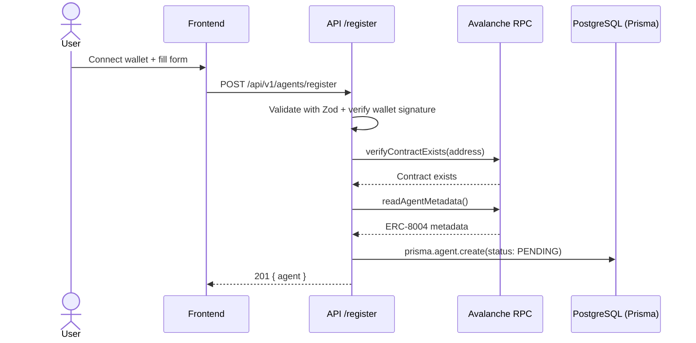
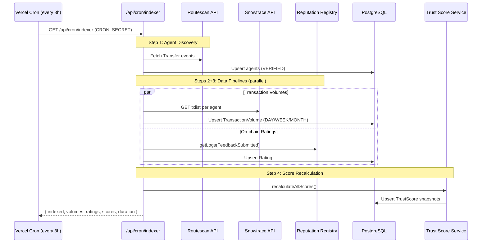
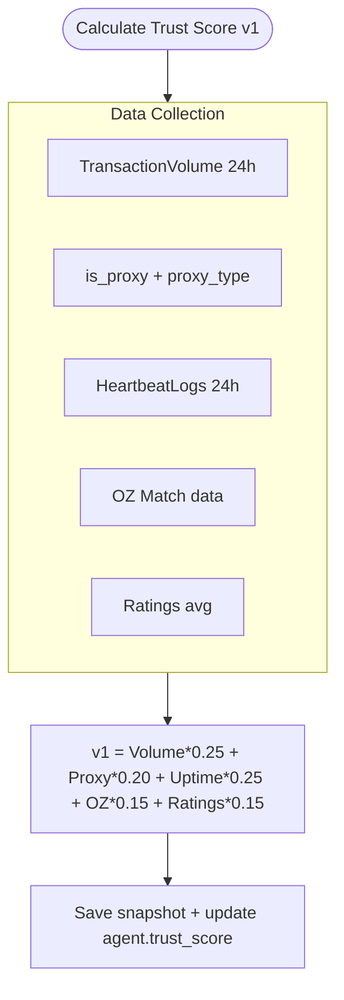
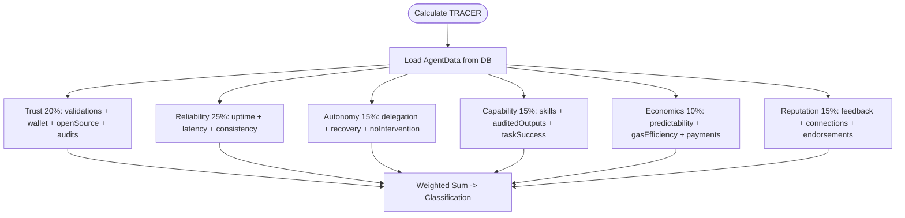
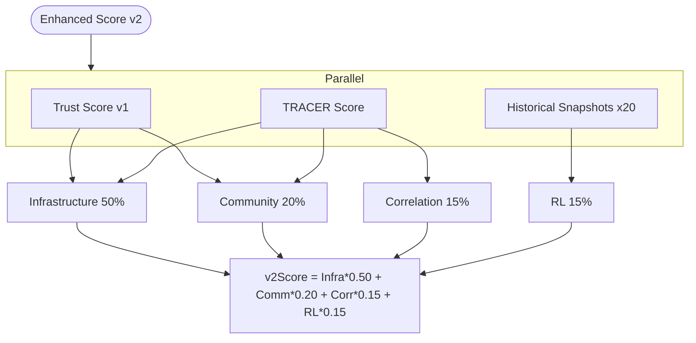
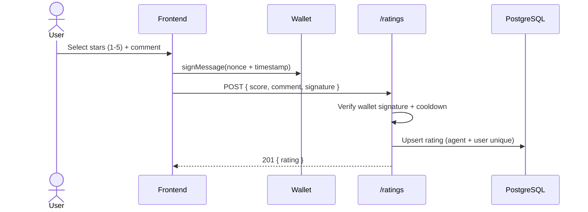
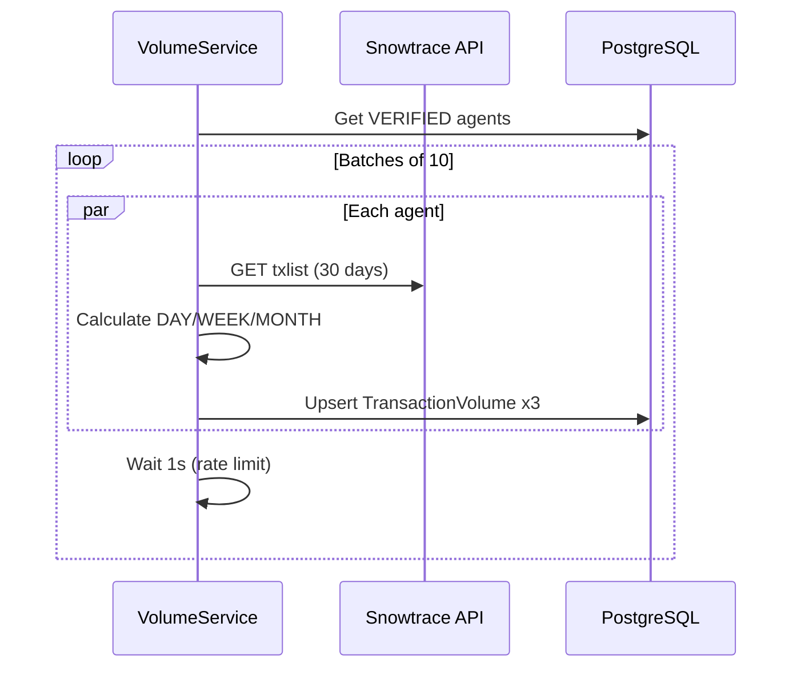

# Data Flows

## Flow 1: Agent Registration

## Flow 2: Indexer Discovery (Cron — 4 Steps)

## Flow 3: Trust Score v1 Calculation

## Flow 4: TRACER Score Calculation

## Flow 5: Combined Trust Score v2

## Flow 6: Rating Submission

## Flow 7: Transaction Volume Pipeline

## Trust Score Ranges

| Range | Label | Color |
|-------|-------|-------|
| 90-100 | Excellent | Green |
| 75-89 | Good | Blue |
| 60-74 | Acceptable | Yellow |
| 40-59 | Poor | Orange |
| 0-39 | Unreliable | Red |
