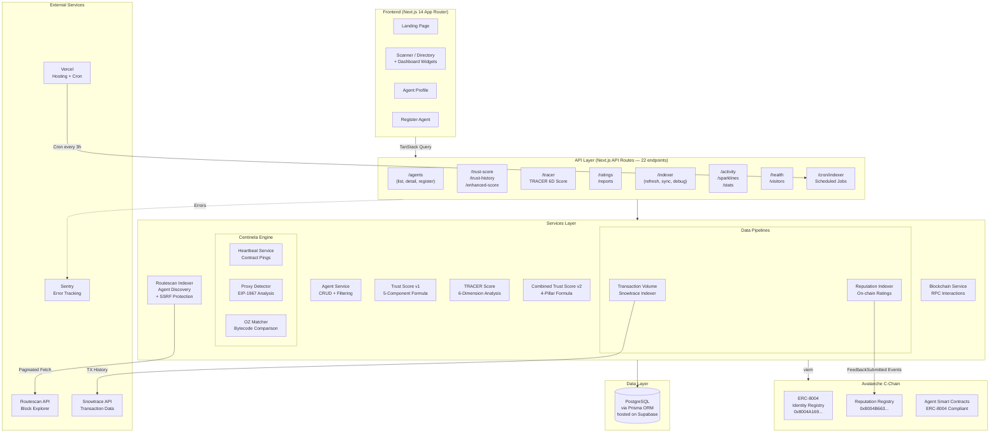
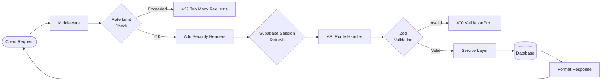
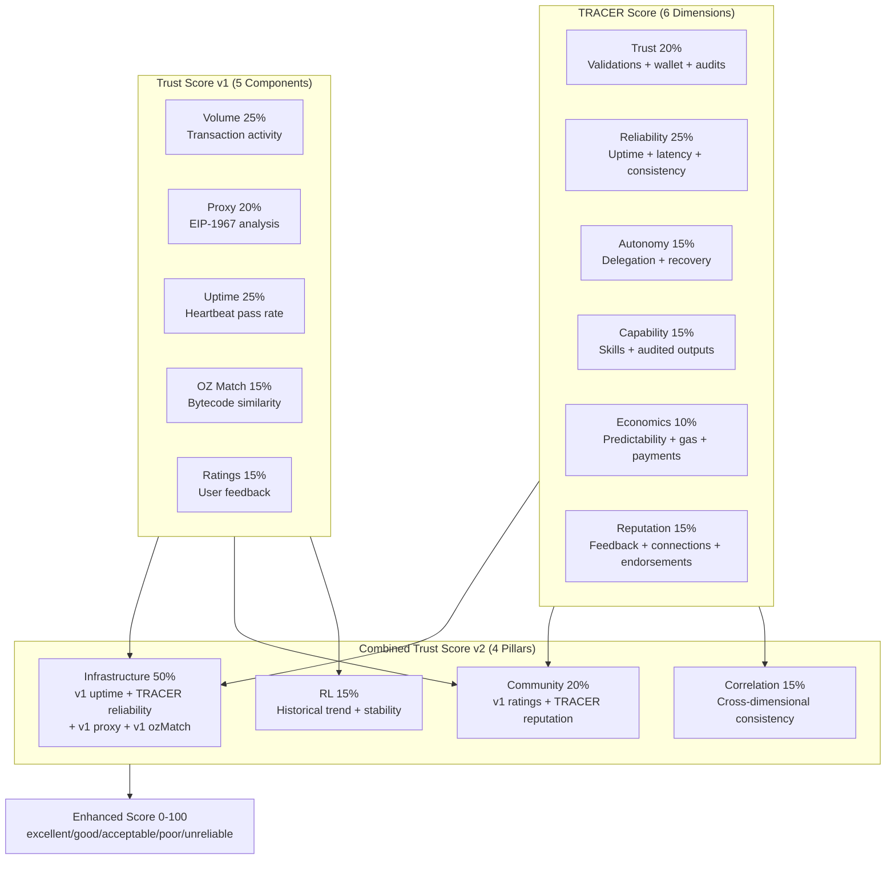

# System Architecture

## High-Level Diagram

## Request Lifecycle

## Scoring Architecture

## System Components

### Frontend (Next.js App)

**Responsibilities**:
- Render UI (landing, scanner with dashboard widgets, agent profile)
- Connect wallet (wagmi + viem)
- Consume REST API via TanStack Query
- Client-side validation (Zod)
- Dashboard: ActivityChart, TopAgentsList, RiskAlerts, RecentActivity, KpiCard

### Backend (Next.js API Routes — 22 endpoints)

**Responsibilities**:
- Expose REST endpoints
- Validate requests (Zod schemas)
- Authenticate wallets (verify signatures with viem)
- Database queries via Prisma ORM
- Avalanche RPC queries (via viem with fallback transport)
- Rate limiting (100/min default, 5/hour registration)
- Structured logging (Pino)

### Indexer (Background Job)

**Responsibilities**:
- Run every 3 hours via Vercel Cron
- Step 1: Scan ERC-8004 Identity Registry via Routescan API
- Step 2: Sync transaction volumes from Snowtrace API
- Step 3: Import on-chain ratings from Reputation Registry
- Step 4: Recalculate trust scores for all agents
- SSRF protection on tokenURI fetching (isUrlSafe)

### Centinela (Verification Engine)

**Responsibilities**:
- **Heartbeat**: Ping agent contracts to verify uptime
- **Proxy Detection**: Analyze EIP-1967 storage slots
- **OZ Matcher**: Compare bytecode against OpenZeppelin selectors

### TRACER Score Engine

**Responsibilities**:
- 6-dimension trust analysis using real DB data
- Trust(20%) + Reliability(25%) + Autonomy(15%) + Capability(15%) + Economics(10%) + Reputation(15%)

### Combined Trust Score v2

**Responsibilities**:
- Merge v1 + TRACER into 4 pillars
- Infrastructure(50%) + Community(20%) + Correlation(15%) + RL(15%)
- Historical trend analysis with reinforcement learning

### Data Pipelines

- **Transaction Volume**: Snowtrace API, DAY/WEEK/MONTH
- **Reputation Indexer**: FeedbackSubmitted events from 0x8004B663

### Database (Supabase PostgreSQL + Prisma)

- 14 models: Agent, TrustScore, Rating, HeartbeatLog, TransactionVolume, etc.

## Contract Addresses

| Registry | Address | Purpose |
|----------|---------|---------|
| Identity | `0x8004A169FB4a3325136EB29fA0ceB6D2e539a432` | ERC-8004 agent registration |
| Reputation | `0x8004B663056A597Dffe9eCcC1965A193B7388713` | On-chain feedback/ratings |

## TRACER Validation Checklist (27 Checks)

| Category | Checks | Max Points |
|----------|--------|------------|
| Metadata | 6 checks | 40 |
| Infrastructure | 8 checks | 35 |
| AWS/Cloud | 8 checks | 25 |
| x402 Payment | 2 checks | 10 |
| Bonus | 3 checks | 10 |
| **Total** | **27** | **120** |

Critical checks: AGENTURL_PARSEABLE, TLS_VALID, HEALTH_2XX
Result: PASS >= 70, PARTIAL >= 40, FAIL < 40
